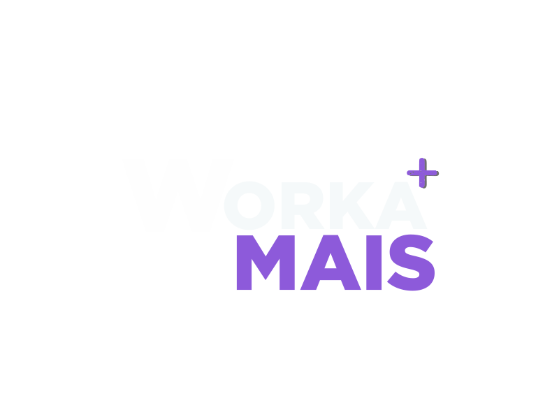

# Bye Bills

A simple manager to bills




## Getting Started

First, run the development server:

```bash
npm install && cd byebills && npm run dev
# or
yarn install && cd byebills && yarn dev
```

## Development and contributions – omg developers
Development is ongoing, and the development team, as well as other volunteers,
can freely work in their own trees and submit pull requests when features or
bug fixes are ready

### For Commit
 - For commit, use `npm run commit` or `yarn commit` because we use commitizen to message pattern

## Scripts

  - Create a new component
  ```bash
  npm run generate
  # or
  yarn generate
  ```

  - Run tests
  ```bash
  npm run test
  # or
  yarn test
  ```

  - Run storybook
  ```bash
  npm run storybook
  # or
  yarn storybook
  ```

## Stack

- Typescript
- React
- Next.js
- chakra-ui
- jest
- storybook
- React Icons
- Apexcharts

## License

[MIT licensed](LICENSE).
